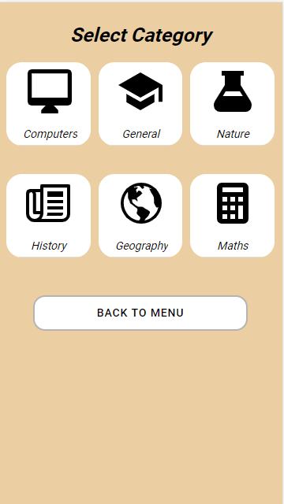
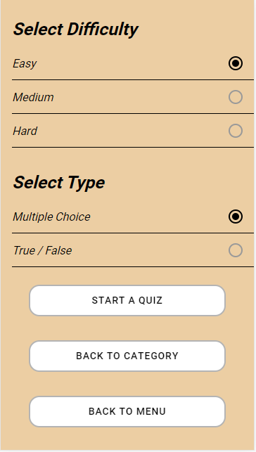
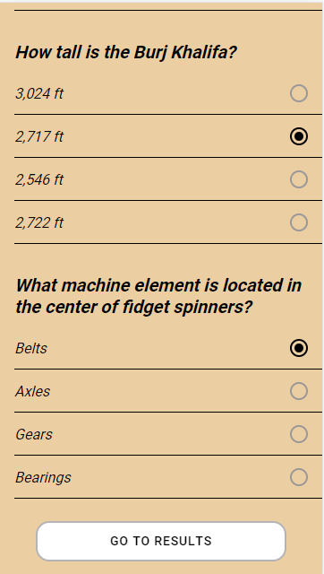
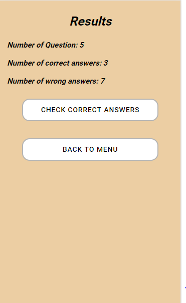
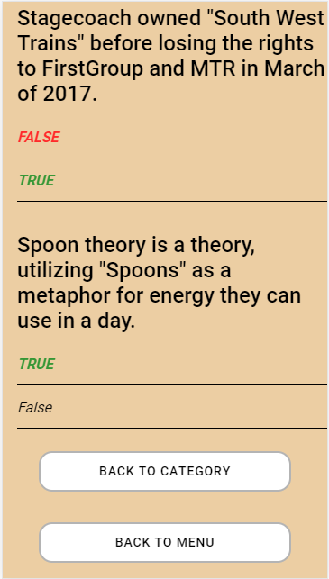
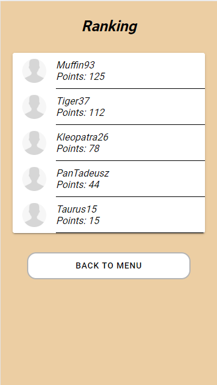
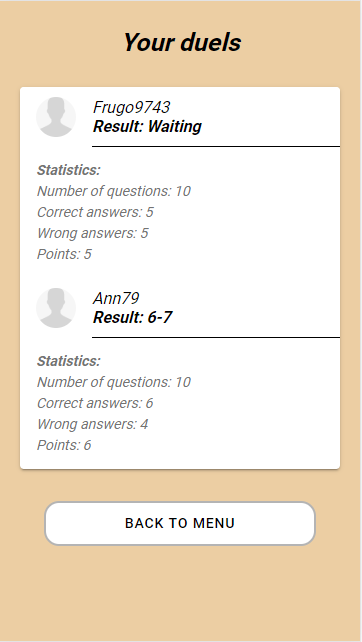
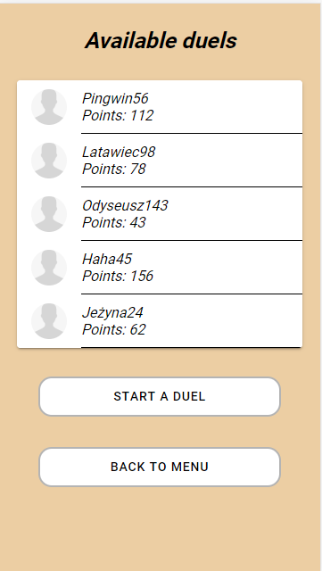
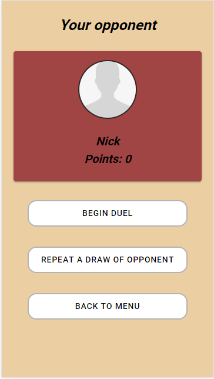

# QuizCinoi

## About project
*Our application helps users to extend their knowledge from any field they want. We created a quiz app, which is a fun and intuitive way to test user's and theirs friends' skills.
We decided to give users freedom to choose category of quiz ( one of the possible six: Computers, General, Nature, History, Geography, Maths ). They can also decide about form and difficulty of questions.
Thanks to that, users can create any quiz they want and find useful.
To enrich a experience of using our application we add a possibility for our users to challenge theirs friends.
Whats more fun than nice evening with your loved ones and some quizzes.*

## App features

**Feature** | **Screen** | **Feature** | **Screen** 
------------ | ------------- | -------------| -------------
*Create your account* |  | *Select Category* | 
*Select Type and Difficulty* |  | *Start a quiz* | 
*Check results of quiz* |  | *Check Correct answers* | 
*Check ranking* |  | *Check results of duels* | 
*Choose your opponent* |  | *Accept your opponent* | 

## Creators
* Daniel Słowik
* Adam Pacholak
* Mateusz Otręba

## Links
1. [GitHub](https://github.com/kkasztann/QuizCinoi)
2. [Trello](https://trello.com/b/lpOgiYPL/quizcinoi-bai)
3. [Prototype](https://github.com/kkasztann/QuizCinoi/blob/master/Prototyp/QuizCinoi.xd)

